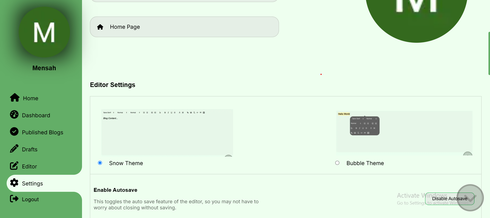

# Full Stack Blog Application

A full-featured blog application built with Next.js. This project provides a dynamic platform where users can read rich blog posts with multimedia content and share them on social networks, while administrators have a secure dashboard to manage posts, categories, and user interactions. The application integrates modern security practices (CSRF protection, rate limiting, input validation, reCAPTCHA) and leverages third-party services for media uploads and storage.

## Demo

| Dark Theme                                                    | Light Theme                                                     |
| ------------------------------------------------------------- | --------------------------------------------------------------- |
|                                |                            |
|                 |                  |
|                         |                          |
|                     |                      |
|  |   |
|                |                 |
|                              |                  |
|     |       |
|           |            |
|       |        |
|                |  |
|          |                        |
|            |        |

## Table of Contents

- [Features](#features)
  - [User Features](#user-features)
  - [Admin Features](#admin-features)
- [Tech Stack](#tech-stack)
- [Getting Started](#getting-started)
- [Environment Variables](#environment-variables)
- [API Endpoints](#api-endpoints)
- [Project Structure](#project-structure)
- [Deployment](#deployment)
- [Contributing](#contributing)
- [License](#license)
- [Additional Notes](#additional-notes)

---

## Features

### User Features

- **Dynamic Content Viewing:**

  - Read blog posts with rich text, images, and embedded media.
  - SEO-friendly pages with automatically generated metadata and Open Graph tags for enhanced social sharing.

- **Responsive UI:**

  - Fully responsive design with adaptive layouts and mobile-specific behavior (e.g. native share API on mobile).

- **Category & Tag Navigation:**
  - Browse posts by categories and tags with intuitive navigation.

### Admin Features

- **Authentication & Admin Dashboard:**

  - Secure user authentication using NextAuth.js (supporting Google, GitHub, LinkedIn, Twitter, Facebook).
  - Dedicated admin panel for managing posts, categories, and system settings.

- **Post Management:**

  - Create, edit, preview, and delete blog posts using a feature-rich editor.
  - Autosave drafts to local storage with URL-based `editId` resumption.
  - Automatic slug generation with uniqueness checks.
  - Media uploads to Cloudinary with automatic base64 conversion and URL replacement.

- **Dynamic Category Management:**

  - Create, edit, and delete categories with custom color themes.
  - When deleting a category, posts are reassigned to a fallback “General” category. The “General” category is preserved and cannot be deleted.

- **Unsaved Changes Warning:**
  - The unsaved changes functionality is implemented in a custom hook on the client side. It listens for beforeunload and popstate events so that if a user attempts to leave the editor page without saving (i.e. when unsaved changes exist), they are prompted to confirm whether they really want to leave. This helps prevent accidental data loss.

---

## Tech Stack

- **Framework:** Next.js (React-based)
- **Styling:** CSS Modules with custom properties and dynamic classes
- **Authentication:** NextAuth.js
- **Database:** MongoDB (accessed via Prisma ORM)
- **Media Storage:** Cloudinary for image and media uploads
- **Email Delivery:** Resend (or nodemailer as a fallback)(`incomplete`)
- **Security:**
  - CSRF token protection
  - Input sanitization (DOMPurify)
  - Rate limiting (next-rate-limit)
  - Google reCAPTCHA integration
- **Other:**
  - Custom hooks for local storage (for autosave functionality)
  - Dynamic module loading (for rich text editors, dropdowns, etc.)

---

## Getting Started

### Prerequisites

- Node.js (v14+)
- A MongoDB instance (local or cloud-based)
- Cloudinary account (with configured upload presets)
- Resend account (or your preferred email provider configured)
- Google reCAPTCHA keys (v2 or v3)

### Installation

1. **Clone the repository:**

   ```bash
   git clone https://github.com/Programming-Sai/Blog.git
   cd Blog
   ```

2. **Install dependencies:**

   ```bash
   npm install
   ```

3. **Create a `.env` file** in the project root with the following variables. Replace the placeholder text with your actual keys/values:

```env
# Database
DATABASE_URL="your-mongodb-connection-string"

# NextAuth Configuration
NEXTAUTH_URL="https://yourdomain.com"         # The URL of your application
NEXTAUTH_SECRET="your-nextauth-secret"

# Authentication Providers
GOOGLE_ID="your-google-client-id"
GOOGLE_SECRET="your-google-client-secret"

GITHUB_ID="your-github-client-id"
GITHUB_SECRET="your-github-client-secret"

LINKEDIN_ID="your-linkedin-client-id"
LINKEDIN_SECRET="your-linkedin-client-secret"

TWITTER_ID="your-twitter-client-id"
TWITTER_SECRET="your-twitter-client-secret"

FACEBOOK_ID="your-facebook-client-id"
FACEBOOK_SECRET="your-facebook-client-secret"

# Base URL
NEXT_PUBLIC_BASE_URL="https://yourdomain.com/"

# Google Analytics (Optional)
NEXT_PUBLIC_GOOGLE_ANALYTICS_MEASUREMENT_ID="your-ga-measurement-id"
GOOGLE_ANALYTICS_PROPERTY_ID="your-ga-property-id"
GOOGLE_ANALYTICS_CLIENT_EMAIL="your-ga-client-email"
GOOGLE_ANALYTICS_PRIVATE_KEY="your-ga-private-key"
GOOGLE_ANALYTICS_API_KEY="your-ga-api-key"
GOOGLE_ANALYTICS_ACCESS_TOKEN="your-ga-access-token"

# Cloudinary (Media Uploads)
CLOUDINARY_CLOUD_NAME="your-cloudinary-cloud-name"
NEXT_PUBLIC_CLOUDINARY_CLOUD_NAME="your-cloudinary-cloud-name"
CLOUDINARY_API_KEY="your-cloudinary-api-key"
CLOUDINARY_API_SECRET="your-cloudinary-api-secret"
CLOUDINARY_URL="your-cloudinary-url"
NEXT_PUBLIC_CLOUDINARY_UPLOAD_PRESET="your-upload-preset-for-images"

# Resend Email (for sending emails via the contact form)
RESEND_API_KEY="your-resend-api-key"

# Contact Form Security
CONTACT_TOKEN="your-contact-token"
NEXT_PUBLIC_CONTACT_TOKEN="your-contact-token"

# Google reCAPTCHA
NEXT_PUBLIC_RECAPTCHA_SITE_KEY="your-recaptcha-site-key"
RECAPTCHA_SECRET_KEY="your-recaptcha-secret-key"

# CSRF Tokens (for additional API security)
CSRF_TOKEN="your-csrf-token"
NEXT_PUBLIC_CSRF_TOKEN="your-csrf-token"

# Other (if needed)
CODE="your-code-variable-if-used"
```

4. **Prisma Setup:**

   ```bash
    npx prisma generate
    npx prisma db push
   ```

5. **Run the development server:**

   ```bash
   npm run dev
   ```

## Environment Variables

| Variable                                      | Description                                                    |
| --------------------------------------------- | -------------------------------------------------------------- |
| `DATABASE_URL`                                | MongoDB connection string                                      |
| `NEXTAUTH_URL`                                | URL where your app is hosted (used by NextAuth)                |
| `NEXTAUTH_SECRET`                             | Secret key for NextAuth authentication                         |
| `GOOGLE_ID` / `GOOGLE_SECRET`                 | Google OAuth client ID and secret                              |
| `GITHUB_ID` / `GITHUB_SECRET`                 | GitHub OAuth client ID and secret                              |
| `LINKEDIN_ID` / `LINKEDIN_SECRET`             | LinkedIn OAuth client ID and secret                            |
| `TWITTER_ID` / `TWITTER_SECRET`               | Twitter OAuth client ID and secret                             |
| `FACEBOOK_ID` / `FACEBOOK_SECRET`             | Facebook OAuth client ID and secret                            |
| `NEXT_PUBLIC_BASE_URL`                        | Base URL of your application (used for links, API calls, etc.) |
| `NEXT_PUBLIC_GOOGLE_ANALYTICS_MEASUREMENT_ID` | Google Analytics measurement ID (if using GA)                  |
| `GOOGLE_ANALYTICS_PROPERTY_ID`                | Google Analytics property ID                                   |
| `GOOGLE_ANALYTICS_CLIENT_EMAIL`               | Service account email for Google Analytics (if applicable)     |
| `GOOGLE_ANALYTICS_PRIVATE_KEY`                | Private key for Google Analytics (if applicable)               |
| `GOOGLE_ANALYTICS_API_KEY`                    | API key for Google Analytics (if applicable)                   |
| `GOOGLE_ANALYTICS_ACCESS_TOKEN`               | Access token for Google Analytics (if applicable)              |
| `CLOUDINARY_CLOUD_NAME`                       | Your Cloudinary cloud name                                     |
| `NEXT_PUBLIC_CLOUDINARY_CLOUD_NAME`           | (Public) Cloudinary cloud name                                 |
| `CLOUDINARY_API_KEY`                          | Cloudinary API key                                             |
| `CLOUDINARY_API_SECRET`                       | Cloudinary API secret                                          |
| `CLOUDINARY_URL`                              | Cloudinary URL (if needed)                                     |
| `NEXT_PUBLIC_CLOUDINARY_UPLOAD_PRESET`        | Upload preset for images on Cloudinary                         |
| `RESEND_API_KEY`                              | API key for Resend email service                               |
| `CONTACT_TOKEN` / `NEXT_PUBLIC_CONTACT_TOKEN` | Token to secure the contact form endpoint                      |
| `NEXT_PUBLIC_RECAPTCHA_SITE_KEY`              | Google reCAPTCHA site key                                      |
| `RECAPTCHA_SECRET_KEY`                        | Google reCAPTCHA secret key                                    |
| `CSRF_TOKEN` / `NEXT_PUBLIC_CSRF_TOKEN`       | CSRF token for securing API endpoints                          |
| `CODE`                                        | (Optional) Additional configuration value                      |

---

## API Endpoints

The backend API is organized under the `src/app/api/` folder. Below is an overview of all available endpoints and their functions:

### Authentication

- **`GET /api/auth/session`**  
  Retrieves the current user session data using NextAuth.
- **`POST /api/auth/[...nextauth]/route.js`**  
  Handles sign in, sign out, and callback logic for all configured OAuth providers (Google, GitHub, LinkedIn, Twitter, Facebook).

### Blog Posts

- **`GET /api/allPosts/route.js`**  
  Retrieves a paginated list of all blog posts.
- **`GET /api/posts/route.js`**  
  Retrieves posts filtered by various parameters (e.g. category, search query) for public display.
- **`GET /api/[slug]/route.js`**  
  Fetches a single blog post by its slug along with its SEO metadata.
- **`POST /api/savePost/route.js`**  
  Creates a new blog post or updates an existing one.  
  _(Admin only)_  
  • Validates and sanitizes the blog content (using DOMPurify)  
  • Processes and uploads any base64 images to Cloudinary  
  • Auto-generates a slug and calculates reading time
- **`GET /api/isSlugUnique/route.js`**  
  Checks if a given slug is unique (supports both new post creation and editing).

### Post Analytics & Statistics

- **`POST /api/updatePostStats/route.js`**  
  Increments view, like, or share counters for a post.
- **`GET /api/topPosts/route.js`**  
  Retrieves the top posts based on view counts for sidebar or featured sections.
- **`GET /api/analytics/route.js`**  
  Provides overall blog analytics data (such as daily visits, unique visits, etc.).

### Category Management

- **`GET /api/categories/route.js`**  
  Retrieves all blog categories.
- **`POST /api/category/route.js`**  
  Creates a new category or updates an existing one.  
  • Automatically generates a slug from the title and capitalizes it.  
  • Accepts additional styling options (e.g., color) for use in the UI.
- **`DELETE /api/category/route.js`**  
  Deletes a category.  
  • If a category is deleted, all posts linked to that category are reassigned to the fallback “General” category.  
  • The “General” category is protected and cannot be deleted.

### Comments

- **`POST /api/comments/route.js`**  
  Creates a new comment on a blog post.
- **`GET /api/comments/route.js`**  
  Retrieves comments for a given blog post.

### Post Moderation & Ownership

- **`POST /api/transferOwnership/route.js`**  
  Allows an admin to transfer blog ownership to another user.
- **`DELETE /api/deleteAllPosts/route.js`**  
  Deletes all posts from the database (Admin only).
- **`DELETE /api/deleteMedia/route.js`**  
  Deletes media files from the database (and optionally from Cloudinary).

### Miscellaneous / Utility Endpoints

- **`POST /api/search/route.js`**  
  Searches for posts based on a query string.
- **`POST /api/searchConsole/route.js`**  
  (Optional) Integrates with Google Search Console for indexing updates.
- **`GET /api/adminPostData/route.js`**  
  Retrieves administrative statistics related to posts (e.g., total posts, pending posts).

### Email / Contact

- **`POST /api/sendEmail/route.js`**  
  Processes contact form submissions. This endpoint is secured with:

  - **CSRF protection:** Checks a CSRF token from the request headers.
  - **Rate limiting:** Uses `next-rate-limit` (e.g., 5 requests per 10 minutes per IP).
  - **Input validation:** Uses Zod to validate the `from`, `subject`, `message`, and `captchaToken` fields.
  - **reCAPTCHA Verification:** Validates the reCAPTCHA token with Google’s API.
  - **Email Delivery:** Uses Resend to send the message to all admin emails fetched from the database.

  **Note:** In production, the `from` field may be replaced by one of your verified admin email addresses if your domain isn’t verified on Resend.

---

## Project Structure

```ftt

./Blog/*
        ├─ prisma/*
        |       └─ schema.prisma
        ├─ public/*
        |       ├─ bubble-theme-dark.png
        |       ├─ bubble-theme-light.png
        |       ├─ coding.png
        |       ├─ culture.png
        |       ├─ facebook.png
        |       ├─ fashion.png
        |       ├─ food.png
        |       ├─ Github.png
        |       ├─ Google.png
        |       ├─ google8b3f1fe30ff856c4.html
        |       ├─ heroAnimation.gif
        |       ├─ instagram.png
        |       ├─ LinkedIn.png
        |       ├─ LinkedInAvatar.png
        |       ├─ logo.png
        |       ├─ moon.png
        |       ├─ p1.jpeg
        |       ├─ privacyheroanim.gif
        |       ├─ snow-theme-dark.png
        |       ├─ snow-theme-light.png
        |       ├─ style.png
        |       ├─ sun.png
        |       ├─ tiktok.png
        |       ├─ travel.png
        |       ├─ X.png
        |       └─ youtube.png
        ├─ src/*
        |       ├─ app/*
        |       |       ├─ about/*
        |       |       |       ├─ about.module.css
        |       |       |       └─ page.jsx
        |       |       ├─ admin/*
        |       |       |       ├─ dashboard/*
        |       |       |       |       ├─ dashboard.module.css
        |       |       |       |       └─ page.jsx
        |       |       |       ├─ drafts/*
        |       |       |       |       ├─ drafts.module.css
        |       |       |       |       └─ page.jsx
        |       |       |       ├─ editor/*
        |       |       |       |       ├─ editor.module.css
        |       |       |       |       └─ page.jsx
        |       |       |       ├─ published-blogs/*
        |       |       |       |       ├─ page.jsx
        |       |       |       |       └─ publishedblogs.module.css
        |       |       |       ├─ settings/*
        |       |       |       |       ├─ page.jsx
        |       |       |       |       └─ settings.module.css
        |       |       |       ├─ admin-not-found.jsx
        |       |       |       ├─ admin-not-found.module.css
        |       |       |       ├─ globals.css
        |       |       |       ├─ layout.js
        |       |       |       ├─ loading.jsx
        |       |       |       └─ page.jsx
        |       |       ├─ api/*
        |       |       |       ├─ adminPostData/*
        |       |       |       |       └─ route.js
        |       |       |       ├─ allPosts/*
        |       |       |       |       └─ route.js
        |       |       |       ├─ analytics/*
        |       |       |       |       └─ route.js
        |       |       |       ├─ auth/*
        |       |       |       |       └─ [...nextauth]/*
        |       |       |       |               └─ route.js
        |       |       |       ├─ categories/*
        |       |       |       |       └─ route.js
        |       |       |       ├─ comments/*
        |       |       |       |       └─ route.js
        |       |       |       ├─ deleteAllPosts/*
        |       |       |       |       └─ route.js
        |       |       |       ├─ deleteMedia/*
        |       |       |       |       └─ route.js
        |       |       |       ├─ downloadAllPosts/*
        |       |       |       |       └─ route.js
        |       |       |       ├─ editorPick/*
        |       |       |       |       └─ route.js
        |       |       |       ├─ featuredPost/*
        |       |       |       |       └─ route.js
        |       |       |       ├─ getPost/*
        |       |       |       |       └─ route.js
        |       |       |       ├─ isSlugUnique/*
        |       |       |       |       └─ route.js
        |       |       |       ├─ posts/*
        |       |       |       |       └─ route.js
        |       |       |       ├─ savePost/*
        |       |       |       |       └─ route.js
        |       |       |       ├─ search/*
        |       |       |       |       └─ route.js
        |       |       |       ├─ searchConsole/*
        |       |       |       |       └─ route.js
        |       |       |       ├─ sendEmail/*
        |       |       |       |       └─ route.js
        |       |       |       ├─ topPosts/*
        |       |       |       |       └─ route.js
        |       |       |       ├─ transferOwnership/*
        |       |       |       |       └─ route.js
        |       |       |       ├─ updatePostStats/*
        |       |       |       |       └─ route.js
        |       |       |       └─ [slug]/*
        |       |       |               └─ route.js
        |       |       ├─ category/*
        |       |       |       └─ [category]/*
        |       |       |               ├─ category.module.css
        |       |       |               ├─ layout.js
        |       |       |               └─ page.jsx
        |       |       ├─ contact/*
        |       |       |       ├─ contact.module.css
        |       |       |       └─ page.jsx
        |       |       ├─ login/*
        |       |       |       ├─ login.module.css
        |       |       |       └─ page.jsx
        |       |       ├─ not-authorized/*
        |       |       |       └─ page.jsx
        |       |       ├─ preview/*
        |       |       |       └─ [slug]/*
        |       |       |               ├─ page.jsx
        |       |       |               └─ previewpage.module.css
        |       |       ├─ privacy-policy/*
        |       |       |       ├─ page.jsx
        |       |       |       └─ privacypolicy.module.css
        |       |       ├─ [slug]/*
        |       |       |       ├─ page.jsx
        |       |       |       └─ singleblogpage.module.css
        |       |       ├─ favicon.ico
        |       |       ├─ general-not-found.jsx
        |       |       ├─ globals.css
        |       |       ├─ layout.js
        |       |       ├─ loading.jsx
        |       |       ├─ not-found-page-toggler.jsx
        |       |       ├─ not-found.jsx
        |       |       ├─ not-found.module.css
        |       |       ├─ opengraph-image.png
        |       |       ├─ page.jsx
        |       |       ├─ robots.js
        |       |       └─ sitemap.js
        |       ├─ components/*
        |       |       ├─ aboutcontent/*
        |       |       |       ├─ AboutContent.jsx
        |       |       |       └─ aboutcontent.module.css
        |       |       ├─ aboutherosection/*
        |       |       |       ├─ AboutHeroSection.jsx
        |       |       |       └─ aboutherosection.module.css
        |       |       ├─ admincommentssection/*
        |       |       |       ├─ AdminCommentsSection.jsx
        |       |       |       └─ admincommentssection.module.css
        |       |       ├─ adminrecentpost/*
        |       |       |       ├─ adminrecentpost.module.css
        |       |       |       └─ AdminRecentPosts.jsx
        |       |       ├─ authlinks/*
        |       |       |       ├─ AuthLinks.jsx
        |       |       |       └─ authlinks.module.css
        |       |       ├─ blogtable/*
        |       |       |       ├─ BlogTable.jsx
        |       |       |       └─ blogtable.module.css
        |       |       ├─ card/*
        |       |       |       ├─ Card.jsx
        |       |       |       └─ card.module.css
        |       |       ├─ charts/*
        |       |       |       ├─ Charts.jsx
        |       |       |       └─ charts.module.css
        |       |       ├─ commentsection/*
        |       |       |       ├─ CommentSection.jsx
        |       |       |       └─ commentsection.module.css
        |       |       ├─ componentloader/*
        |       |       |       ├─ ComponentLoader.jsx
        |       |       |       └─ componentloader.module.css
        |       |       ├─ contactcontentsection/*
        |       |       |       ├─ ContactContentSection.jsx
        |       |       |       └─ contactcontentsection.module.css
        |       |       ├─ contactheorsection/*
        |       |       |       ├─ ContactHeroSection.jsx
        |       |       |       └─ contactherosection.module.css
        |       |       ├─ content/*
        |       |       |       ├─ Content.jsx
        |       |       |       └─ content.module.css
        |       |       ├─ dropdown/*
        |       |       |       ├─ DropDown.jsx
        |       |       |       └─ dropdown.module.css
        |       |       ├─ editorone/*
        |       |       |       ├─ EditorOne.jsx
        |       |       |       └─ editorone.module.css
        |       |       ├─ editorpick/*
        |       |       |       ├─ EditorPick.jsx
        |       |       |       └─ editorpick.module.css
        |       |       ├─ editorthree/*
        |       |       |       ├─ EditorThree.jsx
        |       |       |       └─ editorthree.module.css
        |       |       ├─ featuredsection/*
        |       |       |       ├─ FeaturedSection.jsx
        |       |       |       └─ featuredsection.module.css
        |       |       ├─ footer/*
        |       |       |       ├─ Footer.jsx
        |       |       |       └─ footer.module.css
        |       |       ├─ glow/*
        |       |       |       ├─ Glow.jsx
        |       |       |       └─ glow.module.css
        |       |       ├─ Home/*
        |       |       |       ├─ Home.jsx
        |       |       |       └─ home.module.css
        |       |       ├─ homewrappers/*
        |       |       |       ├─ EditorPickWrapper.jsx
        |       |       |       ├─ FeaturedSectionWrapper.jsx
        |       |       |       ├─ PopularPostsWrapper.jsx
        |       |       |       └─ PopularTagWrapper.jsx
        |       |       ├─ imageuploader/*
        |       |       |       ├─ ImageUploader.jsx
        |       |       |       └─ imageuploader.module.css
        |       |       ├─ likeshareview/*
        |       |       |       ├─ LikeShareView.jsx
        |       |       |       └─ likeshareview.module.css
        |       |       ├─ navbar/*
        |       |       |       ├─ Navbar.jsx
        |       |       |       └─ navbar.module.css
        |       |       ├─ navbarserver/*
        |       |       |       ├─ NavbarServer.jsx
        |       |       |       └─ navbarserver.module.css
        |       |       ├─ navtext/*
        |       |       |       ├─ NavText.jsx
        |       |       |       └─ navtext.module.css
        |       |       ├─ pageloader/*
        |       |       |       ├─ PageLoader.jsx
        |       |       |       └─ pageloader.module.css
        |       |       ├─ pagewrapper/*
        |       |       |       ├─ Wrapper.jsx
        |       |       |       └─ wrapper.module.css
        |       |       ├─ pagination/*
        |       |       |       ├─ Pagination.jsx
        |       |       |       └─ pagination.module.css
        |       |       ├─ popularposts/*
        |       |       |       ├─ PopularPosts.jsx
        |       |       |       └─ popularposts.module.css
        |       |       ├─ populartags/*
        |       |       |       ├─ PopularTags.jsx
        |       |       |       └─ populartags.module.css
        |       |       ├─ previewcontentpage/*
        |       |       |       ├─ PreviewContentPage.jsx
        |       |       |       └─ previewcontentpage.module.css
        |       |       ├─ previewpagewrapper/*
        |       |       |       └─ PreviewPageWrapper.jsx
        |       |       ├─ privacypolicycontent/*
        |       |       |       ├─ PrivacyPolicyContent.jsx
        |       |       |       └─ privacypolicycontent.module.css
        |       |       ├─ privacypolicyherosection/*
        |       |       |       ├─ PrivacyPolicyHeroSection.jsx
        |       |       |       └─ privacypolicyherosection.module.css
        |       |       ├─ recentposts/*
        |       |       |       ├─ RecentPosts.jsx
        |       |       |       └─ recentposts.module.css
        |       |       ├─ recentpostwrapper/*
        |       |       |       ├─ RecentPostsWrapper.jsx
        |       |       |       └─ recentpostwrapper.module.css
        |       |       ├─ scrolltotopbutton/*
        |       |       |       ├─ ScrollToTopButton.jsx
        |       |       |       └─ scrolltotopbutton.module.css
        |       |       ├─ scrolltotopwrapper/*
        |       |       |       ├─ authlinks.module.css
        |       |       |       └─ ScrollToTopWrapper.jsx
        |       |       ├─ searchbar/*
        |       |       |       ├─ Searchbar.jsx
        |       |       |       └─ searchbar.module.css
        |       |       ├─ serverstatus/*
        |       |       |       ├─ ServerStatus.jsx
        |       |       |       └─ serverstatus.module.css
        |       |       ├─ sidenavbar/*
        |       |       |       ├─ SideNavbar.jsx
        |       |       |       └─ sidenavbar.module.css
        |       |       ├─ sidepanel/*
        |       |       |       ├─ SidePanel.jsx
        |       |       |       └─ sidepanel.module.css
        |       |       ├─ taginput/*
        |       |       |       ├─ TagInput.jsx
        |       |       |       └─ taginput.module.css
        |       |       ├─ themetoggle/*
        |       |       |       ├─ ThemeToggle.jsx
        |       |       |       └─ themetoggle.module.css
        |       |       ├─ topbar/*
        |       |       |       ├─ TopBar.jsx
        |       |       |       └─ topbar.module.css
        |       |       ├─ writecomment/*
        |       |       |       ├─ WriteComment.jsx
        |       |       |       └─ writecomment.module.css
        |       |       ├─ CommentWrapper.jsx
        |       |       ├─ GoogleAnalyticsWrapper.jsx
        |       |       ├─ UseLocalStorage.js
        |       |       └─ useUnsavedChangeWarning.js
        |       ├─ context/*
        |       |       └─ ThemeContext.jsx
        |       ├─ providers/*
        |       |       ├─ AuthProvider.jsx
        |       |       └─ ThemeProvider.jsx
        |       └─ utils/*
        |               ├─ auth.js
        |               ├─ clientUpdateFuncs.js
        |               ├─ connect.js
        |               └─ imageHandler.js
        ├─ .env
        ├─ .gitignore
        ├─ base.js
        ├─ env_skeleton
        ├─ jsconfig.json
        ├─ next.config.js
        ├─ package-lock.json
        ├─ package.json
        ├─ project_structure.txt
        └─ README.md


```

---

## Deployment

- **Hosting:** Deployed on Vercel.
- **Build:** Run `npm run build` to generate the production build.
- **Environment:** Ensure all environment variables are configured in Vercel.

---

## Contributing

Contributions are welcome! Please follow these steps:

1. Fork the repository.
2. Create a feature branch (`git checkout -b feature/my-feature`).
3. Commit your changes (`git commit -am 'Add new feature'`).
4. Push your branch (`git push origin feature/my-feature`).
5. Open a Pull Request.

---

<!-- ## License

Distributed under the MIT License. See `LICENSE` for more details. -->

---

## Additional Notes

- **Editor Autosave & URL Handling:**
  The editor uses a custom `useLocalStorage` hook to save unsaved changes and automatically updates the URL with an `editId` when a draft is loaded.
- **SEO & Social Sharing:**
  Blog posts and category pages dynamically generate metadata, including Open Graph tags, for better SEO and social media previews.
- **Security & Rate Limiting:**
  API endpoints incorporate rate limiting, CSRF checks, input validation with Zod, and reCAPTCHA verification to protect against abuse (contact page).
- **Email Delivery:**
  The contact form sends emails to all admin users using Resend. Note that if you don’t have a verified domain, you may need to adjust the sender email (e.g., use an admin email).
- **Future Enhancements:**
  - Real-time word counting in the editor.
  - Enhanced analytics and content scheduling.
  - Improved mobile responsiveness and accessibility features.
  - Bug fixes for email sending.

---

## Libraries & Configuration

### Dependencies

Install the following libraries:

- **Core:** `next`, `react`, `react-dom`
- **Database:** `prisma`, `@prisma/client`
- **Authentication:** `next-auth`
- **Rich Text Editor:** (e.g., `react-quill`)
- **Media Handling:** `dompurify` (or `isomorphic-dompurify`), Cloudinary client (via API)
- **Email Delivery:** `resend` (or use Resend’s REST API if the package is unavailable)
- **Validation & Security:** `zod`, `next-rate-limit`, `react-google-recaptcha`
- **Others:** Any dynamic modules used for UI components

### Configuration Steps

1. **Prisma:**
   - Configure `schema.prisma` and run migrations.
2. **NextAuth:**
   - Set up authentication providers in `[...nextauth]/route.js` with the proper environment variables.
3. **Cloudinary:**
   - Configure upload presets and API credentials.
4. **Resend:**
   - Set your Resend API key and verify a sender domain or use a verified admin email.
5. **Google reCAPTCHA:**
   - Obtain and configure your site and secret keys.
6. **Rate Limiting:**
   - Use `next-rate-limit` to protect API endpoints.
7. **Environment Variables:**
   - Create and configure a `.env` file in the project root.

---
